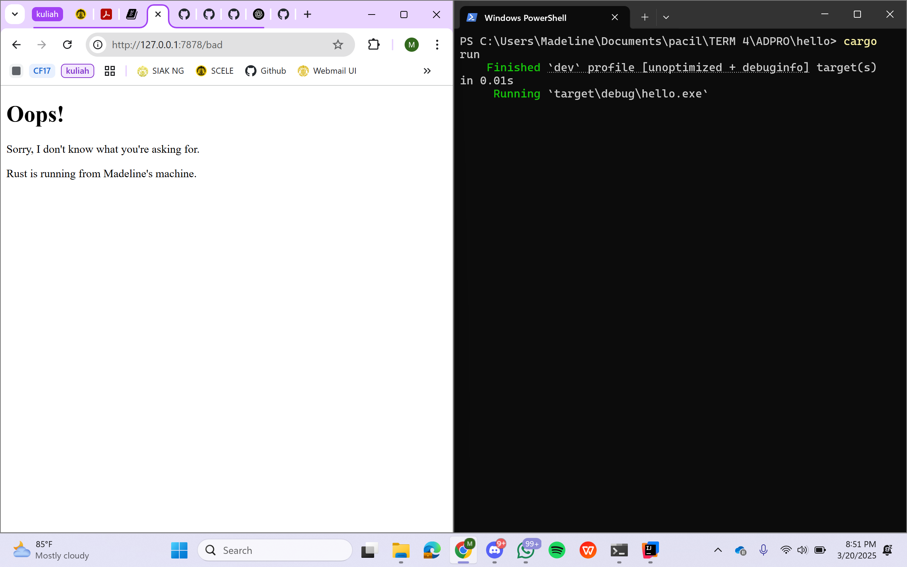

# Tutorial 6 Pemrograman Lanjut: Concurrency
Madeline Clairine Gultom\
2306207846\
ADPRO-A

## Milestone 1: Single threaded web server
Sejauh ini, saya belajar bagaimana kita memproses sebuah request dari web menggunakan bahasa pemrograman Rust. Saya masih perlu mempelajari lebih mendalam mengenai sintaks dan juga alur kinerjanya. Melalui kode main.rs, saya melihat bagaimana cara mengimport, mendefinisikan method, seperti method `main` untuk pusat kontrol dan `handle_connection` untuk membaca dan memproses request dari klien. Selanjutnya, saya akan mengikuti tutorial dan mempelajari lebih lanjut untuk meningkatkan pemahaman saya.

## Milestone 2: Returning HTML
Pada tahap ini, saya telah mempelajari bagaimana sebuah server dapat memproses permintaan HTTP dan menampilkan respons dalam bentuk halaman web. Dengan perubahan pada `main.rs`, server kini tidak hanya membaca request dari klien, tetapi juga mengirimkan respons berupa file `hello.html` menggunakan `fs::read_to_string`, membentuk respons HTTP dan mengirimkannya dengan `stream.write_all()`. Hal ini memberikan wawasan tentang komunikasi dasar antara server dan klien. Saya masih perlu mempelajari lebih lanjut tentang cara menangani berbagai jenis request HTTP sesuai dengan metode yang digunakan, serta bagaimana mengelola error agar server dapat berjalan lebih stabil.

Bukti screenshot:

## Milestone 3: Validating request and selectively responding
Pada tahap ini, saya telah mempelajari bagaimana sebuah server dapat memproses permintaan HTTP dan menampilkan respons dalam bentuk halaman web. Sekarang, server memiliki kondisi yang memungkinkan penanganan berbagai jenis request. Jika permintaan memiliki status `200 OK`, maka `hello.html` akan ditampilkan. Sebaliknya, jika request tidak dikenali, server akan merespons dengan status `404 NOT FOUND` dan menampilkan `404.html`. Hal ini dicapai dengan membaca request line melalui `buf_reader.lines().next().unwrap().unwrap()`, yang mengambil baris pertama dari request HTTP yang dikirim oleh klien dan menentukan respons yang sesuai berdasarkan nilai yang diterima.

Bukti screenshot:

## Milestone 4: Simulation slow response
Pada bagian ini, saya belajar bagaimana memproses suatu request dengan lambat, yaitu menangani request `GET /sleep HTTP/1.1`. Jika klien mengakses `/sleep`, server akan menunggu selama 5 detik yang dapat dilihat melalui   `(thread::sleep(Duration::from_secs(5)))` sebelum mengembalikan halaman `hello.html`. Saya juga melakukan percobaan dengan mengakses `/sleep` terlebih dahulu, lalu mencoba `/`. Hasilnya, request ke `/` harus menunggu hingga proses `/sleep` selesai setelah 5 detik. Sebaliknya, jika langsung mengakses `/`, server dapat merespons segera tanpa ada penundaan.

## Milestone 5: Multithreaded Server
Dalam implementasi kode ini, ThreadPool digunakan untuk mengelola eksekusi tugas secara konkuren dengan membagi beban kerja ke beberapa thread pekerja (Worker). Saat server menerima request melalui `TcpListener`, request tersebut tidak langsung diproses dalam thread utama, melainkan dikirim ke salah satu thread dalam pool menggunakan `pool.execute(|| { handle_connection(stream); })`, sehingga beberapa request dapat diproses secara bersamaan tanpa saling menunggu. ThreadPool dibuat dengan jumlah thread tetap (size), dan setiap `Worker` dalam pool menjalankan loop yang terus menerima tugas dari `mpsc::Receiver<Job>`, yang telah dikunci dengan `Arc<Mutex<T>>` untuk memastikan akses aman dari beberapa thread. Ketika thread pekerja menerima tugas, ia akan mengeksekusinya lalu kembali menunggu tugas berikutnya. Dengan mekanisme ini, server dapat menangani request yang membutuhkan waktu lama, seperti `/sleep`, tanpa menghambat eksekusi request lainnya, sehingga meningkatkan efisiensi dan performa server dalam menangani multiple client secara bersamaan.
