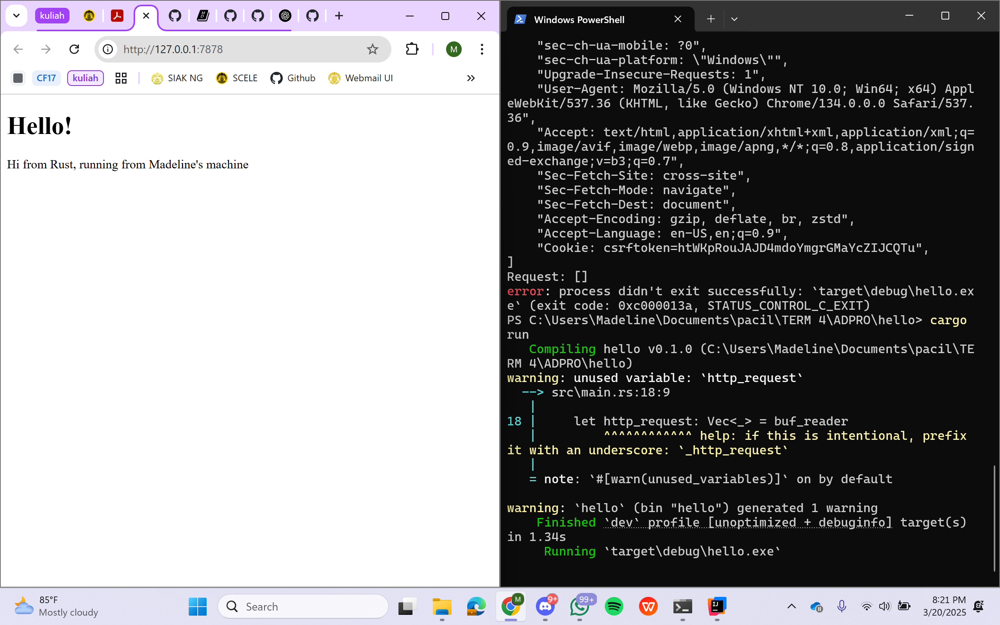

# Tutorial 6 Pemrograman Lanjut: Concurrency
Madeline Clairine Gultom\
2306207846\
ADPRO-A

## Milestone 1: Single threaded web server
Sejauh ini, saya belajar bagaimana kita memproses sebuah request dari web menggunakan bahasa pemrograman Rust. Saya masih perlu mempelajari lebih mendalam mengenai sintaks dan juga alur kinerjanya. Melalui kode main.rs, saya melihat bagaimana cara mengimport, mendefinisikan method, seperti method `main` untuk pusat kontrol dan `handle_connection` untuk membaca dan memproses request dari klien. Selanjutnya, saya akan mengikuti tutorial dan mempelajari lebih lanjut untuk meningkatkan pemahaman saya.

## Milestone 2: Returning HTML
Pada tahap ini, saya telah mempelajari bagaimana sebuah server dapat memproses permintaan HTTP dan menampilkan respons dalam bentuk halaman web. Dengan perubahan pada `main.rs`, server kini tidak hanya membaca request dari klien, tetapi juga mengirimkan respons berupa file `hello.html` menggunakan `fs::read_to_string`, membentuk respons HTTP dan mengirimkannya dengan `stream.write_all()`. Hal ini memberikan wawasan tentang komunikasi dasar antara server dan klien. Saya masih perlu mempelajari lebih lanjut tentang cara menangani berbagai jenis request HTTP sesuai dengan metode yang digunakan, serta bagaimana mengelola error agar server dapat berjalan lebih stabil.

Bukti screenshot:
